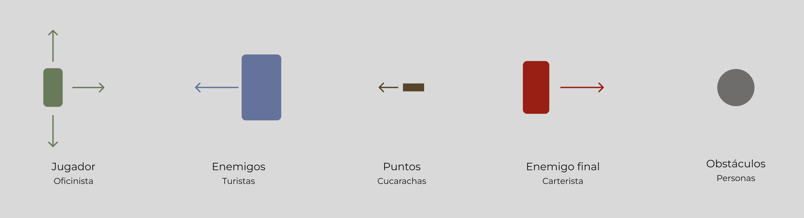

# Barcelona Experience

## Descripción

¿Quieres sentir el día a día viviendo en Barcelona? ¡Ahora lo puedes experimentar!

Eres un oficinista que tiene que llegar al trabajo en metro pero ¡CUIDADO!
El metro en Barcelona esconde muchos peligros.
¿Serás capaz de sortear los peligros y llegar a tu trabajo a tiempo?

## Planificación

### 1. Funcionalidad del juego

Tendrás que esquivar a los guiris/turistas sino quieres que te paren para preguntar dónde comer paela.
Al mismo tiempo puedes conseguir puntos matando las cucarachas del metro. ¡OJO! Estos puntos te ayudarán a pelear contra el final boss:
El carterista o pickpocket del metro.

¡Si consigues evitar al carterista llegarás sano/a al trabajo!

Funcionalidades principales:

- El jugador debe esquivar a los turistas (guiris).
- El jugador puede matar cucarachas para ganar puntos.
- Enfrentamiento final con el boss (carterista).
- Objetivo final: llegar al trabajo esquivando los peligros.

### 2. Diseño del juego (low-fi)

Elementos

Primer escenario: Andén del metro (esquivar turistas)

- El jugador esquiva turistas y pisa cucarachas.
- Objetivo: llegar a la "puerta del metro", al otro extremo de la pantalla.

- Objetivo no conseguido: pierdes y aparece la siguiente pantalla:

Segundo escenario: Interior del metro (batalla con el carterista)

- Objetivo: Vencer al carterista, cruzando el vagón.
- Según los puntos conseguidos anteriormente te encontrarás en un lugar diferente del vagón.

- Objetivo no conseguido: pierdes y aparece la siguiente pantalla:

- Objetivo conseguido:

### 3. Lista de tareas

#### Lista de Tareas

- [x] **Configuración Inicial**

  - [x] Crear un nuevo repositorio en GitHub.
  - [x] Configurar la estructura básica del proyecto.
  - [x] Crear el archivo `index.html` y enlazar CSS y JavaScript.

- [ ] **Desarrollo del Juego**

  - [ ] **Escenario 1: Andén del metro**

    - [x] Implementar el movimiento del jugador.
    - [X] Lógica para esquivar turistas.
    - [x] Lógica para pisar cucarachas y ganar puntos.
    - [X] Crear la pantalla de derrota.
    - [X] Transición a la pantalla del interior del metro.

  - [ ] **Escenario 2: Interior del metro**
    - [ ] Lógica para el enfrentamiento con el carterista.
    - [ ] Lógica para determinar el éxito o fracaso.
    - [ ] Pantalla de derrota.
    - [ ] Pantalla de victoria.

- [ ] **Estilo y Diseño (CSS)**

  - [x] Crear un archivo CSS para el estilo del juego.
  - [ ] Establecer el diseño de los elementos.
  - [ ] Establecer el diseño del andén del metro.
  - [ ] Establecer el diseño del interior del metro.
  - [ ] Estilizar la pantalla de victoria y derrota.

- [ ] **Refactorización**

  - [ ] Revisar el código para mejorar la legibilidad y eficiencia.
  - [ ] Eliminar código redundante.
  - [ ] Documentar funciones y métodos.

- [ ] **Pruebas y Ajustes**

  - [ ] Probar la jugabilidad.
  - [ ] Ajustar la dificultad.
  - [ ] Ajustar la detección de colisiones.

- [ ] **Documentación**
  - [ ] Actualizar el `README.md`.
  - [ ] Documentar el código.

#### Planificación en Días

| Día    | Tarea                                                                                                     |
| ------ | --------------------------------------------------------------------------------------------------------- |
| **1**  | **Configuración Inicial**: Crea el repositorio, estructura básica y el `index.html`.                      |
| **2**  | **Escenario 1**: Implementar el movimiento del jugador y la lógica para esquivar turistas.                |
| **3**  | **Escenario 1**: Implementar la lógica para pisar cucarachas y ganar puntos.                              |
| **4**  | **Escenario 1**: Crear la pantalla de derrota y la transición al interior del metro.                      |
| **5**  | **Escenario 2**: Implementar la lógica para el enfrentamiento con el carterista.                          |
| **6**  | **Escenario 2**: Crear la lógica para determinar el éxito o fracaso en la pelea y la pantalla de derrota. |
| **7**  | **Escenario 2**: Implementar la pantalla de victoria.                                                     |
| **8**  | **Estilo y Diseño**: Crear el CSS para el estilo del juego y diseñar los escenarios.                      |
| **9**  | **Refactorización**: Revisar y mejorar el código, eliminando redundancias y documentando.                 |
| **10** | **Pruebas y Ajustes**: Probar la jugabilidad, ajustar dificultades y detección de colisiones.             |
| **11** | **Documentación**: Actualizar el `README.md` y documentar el código.                                      |

## 4. Organización de OOP

A continuación, se detalla una posible organización de las clases, métodos y atributos para el juego "Barcelona Experience":

### 1. Clases

#### 1. **Juego (Game)**

- **Descripción**: Controla el flujo del juego y la lógica general.
- **Atributos**:
  - `estado`: Estado actual del juego (iniciado, en curso, terminado).
  - `puntuación`: Puntuación acumulada del jugador.
  - `nivel`: Nivel actual (escenario).
- **Métodos**:
  - `iniciarJuego()`: Inicializa el juego.
  - `terminarJuego()`: Finaliza el juego y muestra resultados.
  - `actualizarEstado()`: Actualiza el estado del juego (cambiar de nivel, mostrar mensajes, etc.).

#### 2. **Lógica (Logic)**

- **Descripción**: Maneja la lógica del juego, incluidas las colisiones y el avance del juego.
- **Atributos**:
  - `jugador`: Referencia al objeto `Jugador`.
  - `enemigos`: Lista de enemigos en el juego (turistas y carterista).
  - `cucarachas`: Lista de cucarachas en el juego.
- **Métodos**:
  - `verificarColisiones()`: Verifica si el jugador colisiona con enemigos o cucarachas.
  - `actualizarJuego()`: Actualiza la lógica del juego en cada ciclo (movimiento de enemigos, verificación de colisiones, etc.).

#### 3. **Jugador (Jugador)**

- **Descripción**: Representa al jugador y su estado.
- **Atributos**:
  - `nombre`: Nombre del jugador.
  - `vida`: Vida restante del jugador.
  - `puntuación`: Puntuación acumulada del jugador.
  - `posX`, `posY`: Posición del jugador en la pantalla.
- **Métodos**:
  - `mover(dirección)`: Mueve al jugador en la dirección especificada (izquierda, derecha, adelante).
  - `atacar()`: Matar las cucarachas
  - `recibirDaño()`: Reduce la vida del jugador.

#### 4. **Enemigos (Enemies)**

- **Descripción**: Clase para los enemigos en el juego.
- **Atributos**:
  - `posX`, `posY`: Posición del enemigo en la pantalla.
  - `tipo`: Tipo de enemigo (turista o carterista).
- **Métodos**:
  - `mover()`: Mueve al enemigo en una dirección aleatoria o específica.
  - `interactuarCon(jugador)`: Define la interacción con el jugador (si se choca, por ejemplo).

##### **4.1. Turistas (Tourist)**

- **Descripción**: Representa a los turistas que el jugador debe esquivar.
- **Métodos**:
  - `interactuarCon(jugador)`: Si el jugador choca con un turista, se ejecuta una lógica específica (por ejemplo, detenerse).

##### **4.2. Carterista (Pickpocket)**

- **Descripción**: Representa al carterista, el jefe final.
- **Métodos**:
  - `atacar(jugador)`: Realiza un ataque al jugador.

#### 5. **Cucarachas (Cockroach)**

- **Descripción**: Representa a las cucarachas que el jugador puede matar.
- **Atributos**:
  - `posX`, `posY`: Posición de la cucaracha en la pantalla.
  - `puntos`: Puntos que otorga al ser eliminada.
- **Métodos**:
  - `mover()`: Mueve la cucaracha en un patrón específico.
  - `eliminar()`: Elimina la cucaracha y otorga puntos al jugador.

### 2. Interacciones

- **Colisiones**: Se debe implementar una lógica de colisión que verifique si el jugador interactúa con turistas, cucarachas o el carterista. Esto puede ser parte de la clase `Logic` o un método global.
- **Estado del juego**: La clase `Juego` debe manejar la transición entre diferentes estados (por ejemplo, de `escenario 1` a `escenario 2`), así como el final del juego.

5. Empezar a codear

## Recomendaciones

- Usar ChatGPT para planificar y explicar código.
- Usar Trello para organizar las tareas.
- Crear una rama para cada tarea.

### ¡Hay que hacer al menos 2 commits por día!
